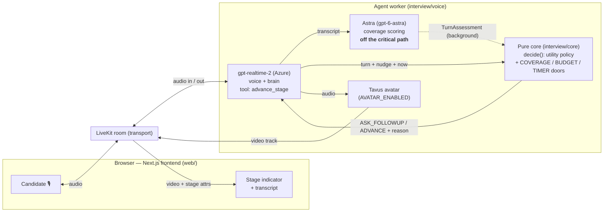

# AI Mock Interview Agent

A real-time **voice** mock-interview agent with a live **avatar**. It runs a candidate
through two stages — **self-introduction → past experience** — and switches between them
with a **controlled, utility-based decision core**, a **time-based fallback**, and no
repeated or double prompts.

- **gpt-realtime-2** (Azure) — the voice-and-brain: listens, reasons, speaks, and calls an
  `advance_stage` tool as a *nudge*.
- **Astra** (`gpt-6-astra`, Azure) — a separate assessor that scores how well each required
  field is covered. Runs **off the critical path**, so it never blocks the conversation.
- **Pure stage machine** — makes the actual switch decision from coverage + a timer.
- **Tavus avatar** — a lip-synced talking head, feature-flagged and failure-isolated.

> Three jobs: **gpt-realtime signals, Astra scores, the stage machine decides.**

## Architecture



Built **inside-out**: the pure decision core first (no I/O, fully tested), then the voice
layer, then the avatar last. The same `decide()` is reused unchanged by every layer.

### Components

| Component | Where | Responsibility |
|---|---|---|
| **Frontend** | `web/` (Next.js + LiveKit) | Captures mic audio, renders the avatar video + transcript, and shows the live **stage indicator + countdown** — driven only by room attributes (`iv_stage` / `iv_reason` / `iv_limit` / `iv_started`), no server logs needed. |
| **LiveKit room** | managed | WebRTC transport. Carries audio both ways, the avatar's video track, and the stage attributes to the browser. |
| **gpt-realtime-2** | `interview/voice` (Azure) | The voice **and** brain: transcribes, reasons, speaks, handles barge-in, and calls the `advance_stage` tool as a *nudge* — it never switches stages itself. |
| **Pure core** | `interview/core` | `decide()` — the utility policy and forward-only state machine. The **only** place a stage switch is decided. No clock, network, or audio; time and scores are passed in. |
| **Astra assessor** | `interview/assess` (Azure) | Scores how well each required field is covered. Runs in a **background task off the critical path**, so the voice never waits on it. |
| **Tavus avatar** | `interview/avatar` | Lip-synced talking head. Behind `AVATAR_ENABLED` and **failure-isolated** — if Tavus errors, the interview continues audio-only, unchanged. |

### Request flow (one turn)

1. Candidate speaks → LiveKit → **gpt-realtime** transcribes and (on end-of-turn) drafts a reply.
2. The transcript is handed to **Astra** in the background; the latest `TurnAssessment` it has produced is read without blocking.
3. **gpt-realtime** passes the turn, its advance nudge, and the current time into **`decide()`**.
4. `decide()` returns **`ASK_FOLLOWUP`** or **`ADVANCE` + a reason** (`COVERAGE` / `BUDGET` / `TIMER` / `UTILITY`).
   - *Ask:* gpt-realtime just generates the next question — the fast path, ~0.1–0.5s to first audio.
   - *Advance:* it speaks exactly **one bridge line**, and the new stage is published to the browser.
5. A background **timer loop** can independently fire an `ADVANCE` with reason `TIMER` — the hard fallback that guarantees the interview always progresses and terminates, even in total silence.

## Key engineering decisions

- **Utility-based, not goal-based.** Every turn the agent scores `ASK_FOLLOWUP` vs
  `ADVANCE` and picks the higher expected utility (coverage, diminishing returns, time
  pressure) — instead of flipping a boolean. Coverage & budget are soft bounds; the
  **timer is a hard override** so the interview always terminates. Each decision is logged
  with its reason (`COVERAGE` / `BUDGET` / `TIMER` / `UTILITY`) and both utilities.
- **The assessor runs off the critical path.** Astra is slow (~5s); it runs in a background
  task and the voice never waits on it, so replies stay ~0.1–0.5s to first audio.
  *Latency is an engineering outcome, not a model property.*
- **Turn-based speech-to-speech (gpt-realtime-2 on Azure), not cascade or full-duplex.**
  It's GA and proven (won't glitch on a recording), has native tool calling (makes the
  controlled switching easy to prove), and runs on one provider. The trade-off given up:
  full-duplex backchannels — a *feel* upgrade, not a requirement.
- **Pure core, swappable seams.** `interview/core/` never touches the clock, network, or
  audio (time and scores are passed in). The assessor sits behind one interface (mock in
  tests, Astra in prod). The avatar is behind `AVATAR_ENABLED` and **fails safe**: if Tavus
  errors, the agent falls back to the exact audio-only interview.

## Running it

**Prerequisites:** Python 3.12, Node 18+ (pnpm), an Azure gpt-realtime deployment + a text
deployment, a LiveKit project, and (optional) a Tavus API key.

```bash
# 1. Backend
python -m venv .venv && source .venv/bin/activate
pip install -r requirements.txt
cp .env.example .env         # fill in Azure + LiveKit (+ Tavus) values

# 2. Frontend
cd web && pnpm install
cp .env.example .env.local   # fill in the same LiveKit values
cd ..

# 3. Run both (agent + frontend), then open http://localhost:3000
./dev.sh                     # avatar on
AVATAR_ENABLED=false ./dev.sh    # audio-only (instant, no avatar)
```

To demo the time-based fallback quickly, shorten the stage timers:
```bash
INTRO_TIME_LIMIT=25 PAST_TIME_LIMIT=35 ./dev.sh   # then go silent to see the TIMER switch
```

You can also drive the Phase-1 decision core from the terminal, no models needed:
```bash
python -m interview.cli
```

## Testing

```bash
pytest            # 22 tests, all green
```
The pure core has its own deterministic suite (10 unit tests + a 500-example Hypothesis
property test) asserting the invariants: never moves backward, never exceeds the follow-up
budget, always terminates, and exactly one bridge line per transition. The voice and avatar
layers add parity, off-critical-path, timer-gating, and **avatar-failure-isolation** tests.

## Repo layout

```
interview/
  core/       # PURE decision core: types, utility policy, state machine  (no I/O)
  assess/     # assessor seam: mock (tests) + Astra (prod) + off-path wrapper
  voice/      # LiveKit + gpt-realtime wiring; the thin glue over the core
  avatar/     # Tavus avatar (cosmetic, feature-flagged, failure-isolated)
  cli.py      # terminal driver for the pure core
tests/        # Phase 1–3 test suites
web/          # Next.js frontend (LiveKit) — mic, transcript, avatar, stage indicator
```
